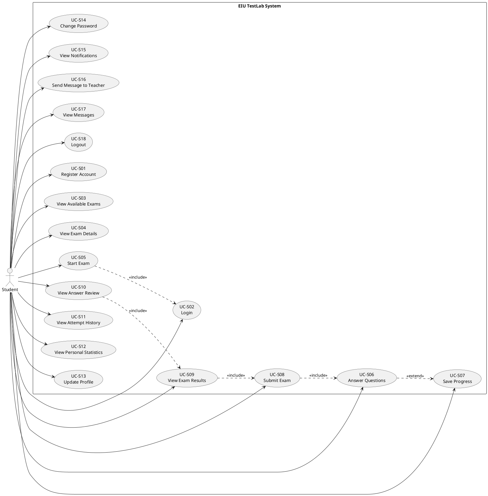
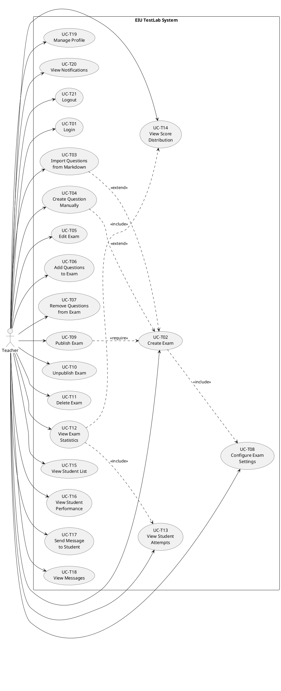
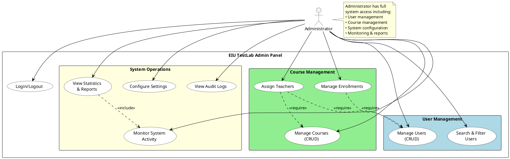

# Kế Hoạch Tạo Báo Cáo Dự Án - CSE310 TestLab Online Exam System

## 📋 Tổng Quan
Tài liệu này mô tả chi tiết từng bước để hoàn thành báo cáo dự án TestLab - Hệ thống thi trực tuyến.

---

## 0. ABSTRACT

**ABSTRACT**

This project presents the development of **EIU TestLab**, a comprehensive web-based examination platform designed for Eastern International University (EIU). The system provides a complete digital solution for educators to create, manage, and conduct online examinations while enabling students to participate in secure, interactive assessments seamlessly.

EIU TestLab is built on a modern **microservices architecture** utilizing **NestJS** (Node.js framework) for the backend and **Next.js 14** (React framework) for the frontend. The system employs **PostgreSQL** as the relational database management system with **Prisma ORM** for efficient data modeling and type-safe database operations, ensuring robust data integrity and scalability.

**Key technological features** include:
- **Full-stack TypeScript** implementation for type safety and maintainable codebase
- **RESTful API architecture** with comprehensive endpoint design for all operations
- **Real-time communication** via **Socket.IO** for instant notifications and live messaging
- **JWT-based authentication** with role-based access control (Student, Teacher, Admin)
- **Responsive UI** powered by **Tailwind CSS** and **Shadcn/ui** component library
- **State management** using Zustand for optimized client-side performance

**Core functionalities** encompass multi-role user management, dynamic exam creation with multiple question types (multiple choice, multiple selection, text/code responses), and innovative **Markdown-based question import** capabilities for streamlined exam preparation. The system features automatic grading for objective questions, real-time exam attempt tracking with auto-save mechanisms, comprehensive statistical analysis and reporting dashboards, and email notification services for important events.

**Security and reliability** are prioritized through enterprise-grade authentication mechanisms, password hashing with bcrypt, session management, CORS configuration, input validation and sanitization, and database transaction management for data consistency.

The platform demonstrates the practical application of **Software Engineering principles** and modern web development best practices, including modular architecture with separation of concerns, DTO (Data Transfer Objects) pattern for API contracts, service-oriented design, dependency injection, and environment-based configuration management.

This project delivers to EIU a **production-ready, scalable, and maintainable** online examination system that significantly enhances the digital learning experience. The architecture supports future extensibility, performance optimization, and integration with additional educational tools, positioning EIU TestLab as a sustainable solution for modern academic assessment needs.

**Keywords:** Online Examination System, NestJS, Next.js, TypeScript, Prisma ORM, PostgreSQL, Real-time Communication, Educational Technology, Web Development, Software Engineering

---

## ACKNOWLEDGEMENT

First, I would like to express my sincere gratitude to my supervisor, **Mr. Hà Minh Ngọc**, for his patient guidance, valuable feedback, and continuous support throughout this project. His professional advice and constructive criticism have been instrumental in both my learning process and the successful completion of this work. His expertise and mentorship have greatly enhanced the quality of this project.

I am also deeply indebted to the faculty and staff of the **School of Computing and Information Technology, Eastern International University**, for creating a supportive and stimulating academic environment. The facilities, resources, and technical support provided have been essential to conducting this research and development work.

Special thanks go to my fellow team members for their collaboration, dedication, and mutual support throughout the development lifecycle. Their contributions in various aspects of the project—from design and implementation to testing and documentation—have been invaluable.

I would also like to acknowledge the open-source community and the developers of NestJS, Next.js, Prisma, and other technologies used in this project. Their excellent documentation and community support have significantly facilitated the development process.

Finally, I extend my heartfelt appreciation to my family and friends for their unwavering encouragement, understanding, and moral support during the entire course of this project.

This project would not have been possible without the collective support and contributions of all these individuals and institutions.

---

## 1. TRANG BÌA VÀ MỤC LỤC

### 1.1 Trang bìa
- [ ] Thêm logo trường (EIU)
- [ ] Tiêu đề dự án: "CSE310 TestLab - Online Exam System"
- [ ] Thông tin môn học: CSE310 - Software Engineering
- [ ] Họ tên thành viên nhóm và MSSV
- [ ] Tên giảng viên hướng dẫn
- [ ] Học kỳ và năm học
- [ ] Ngày nộp báo cáo

### 1.2 Mục lục
- [ ] Liệt kê tất cả các chương, mục, mục con
- [ ] Đánh số trang chính xác
- [ ] Danh sách hình ảnh (nếu có)
- [ ] Danh sách bảng biểu (nếu có)

---

## 2. OVERVIEW

### 2.1 Introduction

Traditional paper-based examination systems, while familiar and time-tested, present numerous challenges in today's digital age. These include logistical complexities in exam distribution and collection, time-consuming manual grading processes, difficulties in maintaining exam security, limited flexibility in question formats, environmental concerns related to paper usage, and challenges in providing immediate feedback to students. Furthermore, the COVID-19 pandemic has highlighted the urgent need for robust online assessment platforms that can ensure academic continuity while maintaining the integrity and reliability of the examination process.

**EIU TestLab** represents a comprehensive solution designed to address these challenges by providing a modern, web-based examination platform tailored specifically for Eastern International University. The system is architected using cutting-edge web technologies including **NestJS** (Node.js framework) for the backend, **Next.js 14** (React framework) for the frontend, and **PostgreSQL** with **Prisma ORM** for reliable data management, ensuring optimal performance, scalability, and maintainability without the complexity often associated with heavy framework dependencies.

The platform serves multiple user roles within the university ecosystem, primarily focusing on three key stakeholders: **administrators**, **educators** (teachers and professors), and **students**. For educators, the system provides powerful tools for creating diverse examination formats, managing question banks through innovative **Markdown import functionality**, monitoring exam progress in real-time, and analyzing student performance through comprehensive analytics. For students, the platform offers an intuitive interface for accessing assigned examinations, completing assessments within specified timeframes, and reviewing their performance and feedback. For administrators, the system enables centralized user management, system monitoring, and institutional oversight.

### 2.2 Objectives

The primary objective of this project is to develop **EIU TestLab**, a comprehensive web-based online examination system specifically designed for Eastern International University. This system aims to modernize the university's assessment processes by providing a secure, efficient, and user-friendly platform that serves all stakeholders in the academic community.

#### Key Objectives:

**1. Develop a Multi-Role Online Examination Platform**
- Create secure user authentication and role-based access control for students, teachers, and administrators using **JWT tokens** and **bcrypt** password hashing
- Implement intuitive user interfaces tailored for different user roles with responsive design
- Ensure system reliability and high performance during examination periods with support for concurrent users
- Provide real-time updates using **Socket.IO** for instant notifications and live messaging

**2. Advanced Question Management and Exam Creation**
- Support multiple question types: multiple-choice, multiple-selection, text responses, and code questions
- Implement innovative **Markdown import functionality** for rapid question development and bulk question addition
- Provide flexible exam scheduling with specific start/end times and duration management
- Enable exam configuration with customizable parameters (duration, scoring, visibility, publishing)

**3. Automated Assessment and Result Management**
- Develop automatic scoring system for objective questions (multiple-choice and multiple-selection)
- Create comprehensive result tracking with detailed score breakdowns and performance analytics
- Enable immediate feedback delivery to students upon exam submission
- Provide statistical analysis and reporting dashboards for educators and administrators

**4. Technical Excellence and Security**
- Build robust architecture using **NestJS** microservices with **TypeScript** for type safety
- Implement **PostgreSQL** database with **Prisma ORM** for reliable, scalable data storage
- Ensure responsive design compatible across desktop, tablet, and mobile devices using **Tailwind CSS** and **Shadcn/ui**
- Maintain high security standards with CORS configuration, input validation, and database transaction management
- Implement auto-save mechanism to prevent data loss during examinations

**5. Educational Impact and Efficiency**
- Reduce administrative burden on educators through automation of grading and result processing
- Minimize operational costs associated with traditional paper-based examinations (printing, distribution, storage)
- Support the university's digital transformation and sustainability initiatives
- Provide data-driven insights for academic decision-making through comprehensive analytics
- Enable remote and hybrid learning models with accessible online assessments

### 2.3 Related Works

In building EIU TestLab, we examined several existing online testing systems to understand their capabilities, identify best practices, and determine areas for improvement.

#### 2.3.1 Moodle
**Moodle** is a well-known open-source Learning Management System (LMS) that supports comprehensive examination features, including question banks, various question types, automated grading, and detailed analytics. It is a powerful and mature platform with extensive plugin ecosystems.

**Strengths:**
- Comprehensive LMS functionality beyond just examinations
- Large community support and extensive documentation
- Highly customizable with numerous plugins
- Support for multiple question types and grading methods

**Limitations:**
- Can feel heavy and complex, especially for institutions that only need testing features
- Steep learning curve for both administrators and end-users
- Resource-intensive, requiring significant server infrastructure
- User interface can be outdated and less intuitive compared to modern web applications

#### 2.3.2 Google Forms
**Google Forms** is widely used for quick quizzes, surveys, and simple assessments. It integrates seamlessly with Google Workspace and allows automatic scoring of objective questions with easy sharing and collaboration features.

**Strengths:**
- Extremely easy to use with minimal setup required
- Free and readily accessible to anyone with a Google account
- Real-time response collection and basic analytics
- Seamless integration with Google Sheets for data export

**Limitations:**
- Lacks advanced security features required for high-stakes examinations
- Limited question type support and formatting options
- No exam-specific features like time limits, question randomization, or proctoring
- Insufficient analytics and reporting for academic assessment needs
- Not designed for institutional-scale deployment with role-based access control

#### 2.3.3 Azota
**Azota** (azota.vn) is an online examination platform designed specifically for schools and teachers in Vietnam. It provides convenient test creation, automatic scoring, attendance tracking, and mobile-friendly interfaces.

**Strengths:**
- User-friendly interface tailored for Vietnamese educational context
- Quick test creation with intuitive workflows
- Automatic scoring and immediate result delivery
- Popular among K-12 educators for its simplicity

**Limitations:**
- Primarily designed for K-12 education, not optimized for higher education complexity
- Limited scalability and role-specific management required in university contexts
- Less comprehensive analytics and reporting compared to enterprise LMS solutions
- Restricted customization options for institutional branding and workflows

#### 2.3.4 Comparative Analysis and EIU TestLab's Unique Value

From these platforms, common features include exam creation, question management, automated grading, and basic reporting. However, each has significant gaps that EIU TestLab addresses:

**EIU TestLab's Differentiation:**

1. **Modern Technology Stack**: Unlike Moodle's older architecture, EIU TestLab uses cutting-edge technologies (NestJS, Next.js 14, TypeScript) providing better performance, maintainability, and developer experience.

2. **Purpose-Built for Higher Education**: While Google Forms is too simple and Azota targets K-12, EIU TestLab is specifically designed for university-level assessment needs with appropriate complexity and features.

3. **Markdown-Based Question Import**: A unique feature not found in most platforms, allowing educators to rapidly create and import questions using familiar Markdown syntax, significantly reducing exam preparation time.

4. **Focused Functionality**: Instead of offering every possible LMS feature like Moodle, EIU TestLab focuses on what university teachers and students need most: easy exam setup, secure participation, clear results, and comprehensive analytics.

5. **Real-Time Features**: Built-in Socket.IO integration provides instant notifications, live messaging, and real-time monitoring capabilities that are either absent or poorly implemented in competing solutions.

6. **Security and Scalability**: Enterprise-grade security with JWT authentication, role-based access control, and PostgreSQL database ensures both security and scalability for university-wide deployment.

7. **Responsive Modern UI**: Clean, intuitive interface built with Tailwind CSS and Shadcn/ui components, providing superior user experience compared to older platforms.

8. **Open Architecture**: Modular microservices design allows easy extension and integration with other university systems, providing flexibility for future enhancements.

By learning from existing solutions and addressing their limitations, EIU TestLab delivers a focused, modern, and efficient online examination platform that meets the specific needs of Eastern International University while remaining scalable and maintainable for future growth.

---

## 3. TECHNOLOGIES

This section describes the key technologies, frameworks, and tools used in the development of EIU TestLab. The technology stack was carefully selected to ensure performance, scalability, security, and maintainability.

### 3.1 Backend Technologies

#### 3.1.1 Node.js

**What is Node.js?**

Node.js is an open-source JavaScript runtime environment built on Chrome's V8 engine. It allows running JavaScript on the server side, supports non-blocking, event-driven I/O, and is widely used for building fast, scalable web applications.


**Key Features:**
- **Built on Chrome's V8 engine**: Executes JavaScript code with high performance
- **Asynchronous & event-driven**: Handles many connections concurrently without blocking
- **Single-threaded with event loop**: Efficient resource utilization without multiple threads
- **NPM ecosystem**: Access to one of the largest ecosystems of open-source libraries
- **Cross-platform**: Runs on Windows, Linux, macOS, and other operating systems

**Usage in EIU TestLab:**
Node.js serves as the foundation for the backend server, enabling efficient handling of concurrent HTTP requests, WebSocket connections, and real-time features.

#### 3.1.2 NestJS

**What is NestJS?**

NestJS is a progressive Node.js framework for building efficient, reliable, and scalable server-side applications. It uses TypeScript by default and combines elements of Object-Oriented Programming (OOP), Functional Programming (FP), and Functional Reactive Programming (FRP).


**Key Features:**
- **TypeScript-first**: Provides strong typing and better developer experience
- **Modular architecture**: Organizes code into modules for better maintainability
- **Dependency injection**: Built-in IoC container for managing dependencies
- **Decorator-based**: Uses decorators for routing, validation, and metadata
- **Microservices ready**: Supports multiple transport layers and architectural patterns
- **Extensive documentation**: Comprehensive guides and best practices

**Usage in EIU TestLab:**
NestJS is the core backend framework used to structure the application into modules (Auth, Exams, Questions, Attempts, Stats, Notifications, Messages), implement RESTful APIs, handle authentication with JWT guards, and manage business logic through services and controllers.

#### 3.1.3 TypeScript

**What is TypeScript?**

TypeScript is a strongly-typed superset of JavaScript developed by Microsoft. It adds optional static typing, classes, interfaces, and other features to JavaScript, compiling down to plain JavaScript.


**Key Features:**
- **Static type checking**: Catches errors at compile time rather than runtime
- **Enhanced IDE support**: Better autocomplete, refactoring, and navigation
- **Modern JavaScript features**: Supports ES6+ features with backward compatibility
- **Interfaces and generics**: Enables better code organization and reusability
- **Gradual adoption**: Can be introduced incrementally into existing JavaScript projects

**Usage in EIU TestLab:**
TypeScript is used throughout the entire codebase (both backend and frontend), providing type safety, reducing bugs, improving code maintainability, and enhancing developer productivity through better tooling support.

#### 3.1.4 Prisma ORM

**What is Prisma?**

Prisma is a next-generation ORM (Object-Relational Mapping) for Node.js and TypeScript. It provides a type-safe database client, declarative data modeling, and automated migrations.


**Key Features:**
- **Type-safe database client**: Auto-generated types based on database schema
- **Declarative data modeling**: Define models in Prisma schema language
- **Automated migrations**: Generate and run database migrations automatically
- **Query optimization**: Efficient SQL query generation
- **Multi-database support**: Works with PostgreSQL, MySQL, SQLite, SQL Server, MongoDB
- **Prisma Studio**: Visual database browser for data inspection

**Usage in EIU TestLab:**
Prisma ORM manages all database interactions, provides type-safe queries, handles data modeling for users, exams, questions, attempts, courses, enrollments, messages, and notifications, and manages database migrations throughout development.

### 3.2 Database

#### 3.2.1 PostgreSQL

**What is PostgreSQL?**

PostgreSQL is a powerful, open-source relational database management system (RDBMS) known for its reliability, robustness, and performance. It supports advanced data types, complex queries, and ACID compliance.


**Key Features:**
- **ACID compliance**: Ensures data integrity with transactions
- **Advanced data types**: Supports JSON, arrays, geometric types, and custom types
- **Full-text search**: Built-in text search capabilities
- **Extensibility**: Can add custom functions, operators, and data types
- **Concurrency control**: MVCC (Multi-Version Concurrency Control) for high performance
- **Scalability**: Handles large datasets and high transaction volumes

**Usage in EIU TestLab:**
PostgreSQL stores all application data including user accounts, exam definitions, questions, student attempts, answers, scores, courses, enrollments, messages, and notifications. It ensures data integrity through foreign key constraints, transactions, and relational integrity.

### 3.3 Frontend Technologies

#### 3.3.1 Next.js 14

**What is Next.js?**

Next.js is a React framework for building full-stack web applications. It provides server-side rendering (SSR), static site generation (SSG), API routes, and optimized performance out of the box.


**Key Features:**
- **App Router**: Modern routing system with layouts and nested routes
- **Server Components**: Render components on the server for better performance
- **Server-Side Rendering (SSR)**: Dynamic content rendering on the server
- **Static Site Generation (SSG)**: Pre-render pages at build time
- **API Routes**: Built-in API endpoints without separate backend
- **Automatic code splitting**: Loads only necessary JavaScript for each page
- **Image optimization**: Built-in image component with automatic optimization
- **TypeScript support**: First-class TypeScript integration

**Usage in EIU TestLab:**
Next.js 14 powers the entire frontend application, implementing the App Router for navigation, server components for optimized rendering, client components for interactive features, and providing seamless integration with backend APIs.

#### 3.3.2 React

**What is React?**

React is a JavaScript library for building user interfaces, developed and maintained by Meta (Facebook). It enables developers to create reusable UI components and manage application state efficiently.


**Key Features:**
- **Component-based architecture**: Build encapsulated components that manage their own state
- **Virtual DOM**: Efficient updates through DOM diffing algorithm
- **Declarative**: Describe UI based on state, React handles updates
- **Unidirectional data flow**: Predictable data flow from parent to child
- **Hooks**: Manage state and side effects in functional components
- **Large ecosystem**: Extensive libraries and community support

**Usage in EIU TestLab:**
React is the underlying library for Next.js, used to build all UI components including forms, exam interfaces, dashboards, question displays, result charts, and navigation elements.

#### 3.3.3 Tailwind CSS

**What is Tailwind CSS?**

Tailwind CSS is a utility-first CSS framework that provides low-level utility classes for building custom designs directly in HTML/JSX without writing custom CSS.


**Key Features:**
- **Utility-first approach**: Compose designs using pre-defined utility classes
- **Responsive design**: Built-in responsive modifiers for all screen sizes
- **Customization**: Highly configurable through tailwind.config.js
- **Performance**: Automatically removes unused CSS in production
- **Dark mode**: Built-in dark mode support
- **Component-friendly**: Works seamlessly with component-based frameworks

**Usage in EIU TestLab:**
Tailwind CSS styles all UI elements throughout the application, ensures responsive design across devices, maintains consistent design language, and enables rapid UI development with utility classes.

#### 3.3.4 Shadcn/ui

**What is Shadcn/ui?**

Shadcn/ui is a collection of re-usable, accessible, and customizable UI components built with Radix UI and Tailwind CSS. Unlike traditional component libraries, it provides component source code that you can copy and customize.


**Key Features:**
- **Copy-paste components**: Components are copied into your project, not installed as dependencies
- **Fully customizable**: Full control over component code and styling
- **Accessible**: Built on Radix UI primitives for WCAG compliance
- **TypeScript support**: Fully typed components
- **Tailwind-based**: Seamlessly integrates with Tailwind CSS
- **Modern design**: Beautiful, professional components out of the box

**Usage in EIU TestLab:**
Shadcn/ui provides pre-built components including buttons, cards, forms, dialogs, alerts, dropdowns, tooltips, and data tables, ensuring consistent UX patterns, accessibility standards, and accelerated development.

#### 3.3.5 Zustand

**What is Zustand?**

Zustand is a small, fast, and scalable state management solution for React applications. It provides a simple API for managing global state without the boilerplate of Redux.


**Key Features:**
- **Simple API**: Minimal boilerplate compared to other state management libraries
- **TypeScript support**: First-class TypeScript integration
- **Devtools**: Integration with Redux DevTools for debugging
- **No providers**: Direct access to store without context providers
- **Small bundle size**: Minimal impact on application size
- **Async actions**: Built-in support for asynchronous state updates

**Usage in EIU TestLab:**
Zustand manages client-side application state including user authentication state (authStore), current exam data (examStore), UI state, and provides persistent storage for user preferences.

### 3.4 Real-Time Communication

#### 3.4.1 Socket.IO

**What is Socket.IO?**

Socket.IO is a JavaScript library that enables real-time, bidirectional, and event-based communication between web clients and servers. It works on every platform, browser, or device.


**Key Features:**
- **Real-time communication**: Instant message delivery between client and server
- **Automatic reconnection**: Handles connection drops gracefully
- **Binary support**: Can send binary data (images, files)
- **Multiple transports**: Falls back from WebSocket to HTTP long-polling if needed
- **Namespaces and rooms**: Organize connections into logical groups
- **Broadcasting**: Send messages to multiple clients simultaneously

**Usage in EIU TestLab:**
Socket.IO powers real-time features including instant notifications when exams are published, live messaging between teachers and students, real-time exam monitoring for teachers, and automatic UI updates when data changes.

### 3.5 Authentication and Security

#### 3.5.1 JSON Web Tokens (JWT)

**What is JWT?**

JSON Web Token (JWT) is an open standard (RFC 7519) for securely transmitting information between parties as a JSON object. It is commonly used for authentication and information exchange.


**Key Features:**
- **Self-contained**: Contains all necessary information about the user
- **Compact**: Efficient transmission via URL, POST parameter, or HTTP header
- **Stateless**: Server doesn't need to store session data
- **Secure**: Can be signed (HMAC) or encrypted (RSA)
- **Cross-domain**: Works across different domains and services

**Usage in EIU TestLab:**
JWT is used for user authentication, secures API endpoints with JWT guards, stores user role information (Student, Teacher, Admin), and provides stateless session management without server-side session storage.

#### 3.5.2 bcrypt

**What is bcrypt?**

bcrypt is a password-hashing function designed to be slow and computationally expensive, making it resistant to brute-force attacks. It automatically handles salt generation and can be configured to increase security over time.

**Key Features:**
- **Adaptive**: Can increase cost factor as hardware improves
- **Salted hashing**: Automatic salt generation for each password
- **One-way function**: Cannot be reversed to reveal original password
- **Slow by design**: Intentionally computationally expensive to resist attacks
- **Industry standard**: Widely used and trusted for password security

**Usage in EIU TestLab:**
bcrypt hashes all user passwords before storing in the database, verifies passwords during login, ensures secure password storage following security best practices, and protects against rainbow table and brute-force attacks.

### 3.6 Email Service

#### 3.6.1 Nodemailer

**What is Nodemailer?**

Nodemailer is a module for Node.js applications that allows sending emails easily. It supports various transport methods including SMTP, sendmail, and popular email services.

**Key Features:**
- **Multiple transport protocols**: SMTP, sendmail, SES, and more
- **HTML and plain text**: Send formatted emails with HTML content
- **Attachments**: Send files with emails
- **Email templates**: Support for template engines
- **Unicode support**: Send emails in any language
- **Secure**: Supports SSL/TLS encryption

**Usage in EIU TestLab:**
Nodemailer sends email notifications for exam publication alerts, result availability notifications, account-related communications, and password reset emails.

### 3.7 Development Tools

#### 3.7.1 Git

**What is Git?**

Git is a distributed version control system that records changes to files and allows multiple people to collaborate on a project efficiently.


**Key Features:**
- **Distributed**: Every developer has full repository history
- **Branching**: Lightweight branches for parallel development
- **Merging**: Sophisticated merge strategies
- **Performance**: Fast operations for large projects
- **Data integrity**: Cryptographic hash ensures data integrity
- **Collaboration**: Multiple developers can work simultaneously

**Usage in EIU TestLab:**
Git manages version control for the entire codebase, tracks changes and development history, enables collaboration among team members, and facilitates code review through pull requests.

#### 3.7.2 npm (Node Package Manager)

**What is npm?**

npm is the default package manager for Node.js, providing access to hundreds of thousands of reusable code packages and managing project dependencies.

**Key Features:**
- **Package registry**: Largest software registry in the world
- **Dependency management**: Automatic dependency resolution
- **Semantic versioning**: Version control for packages
- **Scripts**: Run custom build and development scripts
- **Security auditing**: Check for vulnerable dependencies
- **Workspaces**: Manage monorepos and multiple packages

**Usage in EIU TestLab:**
npm manages all project dependencies for both backend and frontend, runs development and build scripts, handles package updates and security patches, and facilitates consistent dependency versions across the team.

### 3.8 Additional Technologies

#### 3.8.1 JSON (JavaScript Object Notation)

**What is JSON?**

JSON is a lightweight data-interchange format that is easy for humans to read and write, and easy for machines to parse and generate. It is based on a subset of JavaScript syntax.


**Key Features:**
- **Text-based**: Human-readable data format
- **Language-independent**: Supported by virtually all programming languages
- **Lightweight**: Minimal syntax overhead
- **Structured**: Represents objects, arrays, and primitive data types
- **Widely adopted**: Standard format for web APIs

**Usage in EIU TestLab:**
JSON is used for API request/response payloads, configuration files (package.json, tsconfig.json), data storage format for exam questions and answers, and data exchange between frontend and backend.

#### 3.8.2 HTML5

**What is HTML5?**

HTML5 is the latest version of HyperText Markup Language, the standard language for structuring and presenting content on the web.


**Key Features:**
- **Semantic elements**: `<header>`, `<footer>`, `<article>`, `<section>`, etc.
- **Multimedia support**: Native `<audio>` and `<video>` elements
- **Canvas and SVG**: Graphics rendering without plugins
- **Form enhancements**: New input types and validation
- **Offline storage**: localStorage and sessionStorage APIs
- **Geolocation**: Access to user location

**Usage in EIU TestLab:**
HTML5 provides the semantic structure for all pages, form elements for data input, canvas for potential graphics features, and local storage for client-side data caching.

#### 3.8.3 CSS3

**What is CSS3?**

CSS3 is the latest version of Cascading Style Sheets, used to control the presentation, layout, and appearance of web pages.


**Key Features:**
- **Rounded corners**: `border-radius` property
- **Gradients**: Linear and radial gradients without images
- **Shadows**: `box-shadow` and `text-shadow`
- **Animations and transitions**: Smooth visual effects
- **Flexbox**: Flexible box layout for responsive designs
- **Grid**: Two-dimensional layout system
- **Media queries**: Responsive design for different screen sizes

**Usage in EIU TestLab:**
CSS3 (via Tailwind CSS) styles all visual elements, creates responsive layouts with Flexbox and Grid, implements animations and transitions for better UX, and ensures cross-browser compatibility.

### 3.9 Technology Stack Summary

The EIU TestLab technology stack represents a modern, production-ready architecture:

**Backend:**
- Runtime: Node.js
- Framework: NestJS
- Language: TypeScript
- ORM: Prisma
- Database: PostgreSQL
- Authentication: JWT + bcrypt
- Real-time: Socket.IO
- Email: Nodemailer

**Frontend:**
- Framework: Next.js 14
- Library: React
- Language: TypeScript
- Styling: Tailwind CSS
- Components: Shadcn/ui
- State Management: Zustand
- Real-time: Socket.IO Client

**Development Tools:**
- Version Control: Git
- Package Manager: npm
- Data Format: JSON
- Markup: HTML5
- Styling: CSS3

This carefully selected technology stack ensures that EIU TestLab is performant, scalable, secure, maintainable, and built on industry-standard tools with strong community support.

---

## 4. DATABASE DESIGN

### 4.1 Database Architecture Overview

EIU TestLab implements a **relational database architecture** using **PostgreSQL** as the database management system and **Prisma ORM** for type-safe database operations. This approach offers several advantages for educational environments:

**Advantages:**
- **Data Integrity**: ACID compliance ensures reliable transactions and data consistency
- **Relational Structure**: Complex relationships between users, exams, questions, and attempts
- **Scalability**: PostgreSQL handles large datasets and concurrent users efficiently
- **Type Safety**: Prisma ORM provides compile-time type checking and auto-generated types
- **Query Optimization**: Advanced indexing and query optimization capabilities
- **Concurrent Access**: MVCC (Multi-Version Concurrency Control) for high-performance concurrent operations
- **Migration Management**: Automated schema migrations with version control

### 4.2 Entity-Relationship (ER) Diagram Description

The database schema consists of 9 primary entities with the following relationships:

**Core Entities:**
1. **User** - Stores all user accounts (students, teachers, admins)
2. **Exam** - Examination definitions and configurations
3. **Question** - Individual questions within exams
4. **QuestionOption** - Answer options for multiple-choice questions
5. **Attempt** - Student exam attempts and submissions
6. **Answer** - Student answers to specific questions
7. **Notification** - System notifications for users
8. **NotificationPreference** - User notification settings
9. **Message** - Direct messages between users

**Key Relationships:**
- **User → Exam** (1:N): One teacher creates multiple exams
- **Exam → Question** (1:N): One exam contains multiple questions
- **Question → QuestionOption** (1:N): One question has multiple options
- **User → Attempt** (1:N): One student makes multiple attempts
- **Exam → Attempt** (1:N): One exam has multiple attempts
- **Attempt → Answer** (1:N): One attempt contains multiple answers
- **Question → Answer** (1:N): One question has multiple answer instances
- **User → Notification** (1:N): One user receives multiple notifications
- **User → Message** (N:N): Users can send/receive messages to/from other users

### 4.3 Database Schema - Detailed Table Descriptions

Below are detailed descriptions of each table. Use these specifications to create tables in your documentation:

---

#### **Table 4.1: User Table** (`users`)

**Purpose:** Stores all user accounts including students, teachers, and administrators with authentication credentials and role information.

**Columns:**

| Column Name | Data Type | Constraints | Description |
|------------|-----------|-------------|-------------|
| id | UUID | PRIMARY KEY, DEFAULT uuid() | Unique user identifier |
| username | VARCHAR(255) | UNIQUE, NOT NULL | Login username |
| password | VARCHAR(255) | NOT NULL | Hashed password (bcrypt) |
| email | VARCHAR(255) | UNIQUE, NULLABLE | User email address |
| name | VARCHAR(255) | NOT NULL | Full name of user |
| role | ENUM('ADMIN', 'TEACHER', 'STUDENT') | NOT NULL, DEFAULT 'STUDENT' | User role type |
| courses | TEXT[] | DEFAULT '{}' | Array of enrolled course codes |
| isActive | BOOLEAN | NOT NULL, DEFAULT true | Account active status |
| createdAt | TIMESTAMP | NOT NULL, DEFAULT now() | Account creation timestamp |
| updatedAt | TIMESTAMP | NOT NULL, AUTO UPDATE | Last update timestamp |

**Relationships:**
- One User creates many Exams (as creator)
- One User makes many Attempts (as student)
- One User receives many Notifications
- One User sends/receives many Messages
- One User has one NotificationPreference

**Indexes:**
- PRIMARY KEY on `id`
- UNIQUE INDEX on `username`
- UNIQUE INDEX on `email`
- INDEX on `role` for role-based queries

---

#### **Table 4.2: Exam Table** (`exams`)

**Purpose:** Stores examination definitions, configurations, scheduling, and metadata.

**Columns:**

| Column Name | Data Type | Constraints | Description |
|------------|-----------|-------------|-------------|
| id | UUID | PRIMARY KEY, DEFAULT uuid() | Unique exam identifier |
| title | VARCHAR(255) | NOT NULL | Examination title |
| description | TEXT | NULLABLE | Exam description and instructions |
| subject | VARCHAR(100) | NOT NULL | Subject or course name |
| duration | INTEGER | NOT NULL | Time limit in minutes |
| passingScore | INTEGER | NOT NULL, DEFAULT 60 | Minimum passing score percentage |
| maxAttempts | INTEGER | NULLABLE | Maximum allowed attempts (NULL = unlimited) |
| status | ENUM('DRAFT', 'PUBLISHED', 'ARCHIVED') | NOT NULL, DEFAULT 'DRAFT' | Exam publication status |
| allowedCourses | VARCHAR(500) | NULLABLE | Comma-separated list of allowed course codes |
| startTime | TIMESTAMP | NULLABLE | Exam start time (optional scheduling) |
| endTime | TIMESTAMP | NULLABLE | Exam end time (optional scheduling) |
| createdById | UUID | NOT NULL, FOREIGN KEY → users(id) | Creator teacher ID |
| createdAt | TIMESTAMP | NOT NULL, DEFAULT now() | Exam creation timestamp |
| updatedAt | TIMESTAMP | NOT NULL, AUTO UPDATE | Last update timestamp |

**Relationships:**
- Many Exams belong to one User (creator)
- One Exam has many Questions
- One Exam has many Attempts
- One Exam has many Notifications

**Indexes:**
- PRIMARY KEY on `id`
- FOREIGN KEY INDEX on `createdById`
- INDEX on `status` for filtering published exams
- INDEX on `startTime, endTime` for scheduled exams

---

#### **Table 4.3: Question Table** (`questions`)

**Purpose:** Stores individual questions within examinations with question text, type, and scoring information.

**Columns:**

| Column Name | Data Type | Constraints | Description |
|------------|-----------|-------------|-------------|
| id | UUID | PRIMARY KEY, DEFAULT uuid() | Unique question identifier |
| question | TEXT | NOT NULL | Question text/prompt |
| type | VARCHAR(50) | NOT NULL, DEFAULT 'multiple-choice' | Question type (multiple-choice, true-false, essay) |
| points | INTEGER | NOT NULL, DEFAULT 10 | Points awarded for correct answer |
| order | INTEGER | NOT NULL, DEFAULT 0 | Display order within exam |
| examId | UUID | NOT NULL, FOREIGN KEY → exams(id) CASCADE | Parent exam ID |
| createdAt | TIMESTAMP | NOT NULL, DEFAULT now() | Question creation timestamp |
| updatedAt | TIMESTAMP | NOT NULL, AUTO UPDATE | Last update timestamp |

**Relationships:**
- Many Questions belong to one Exam
- One Question has many QuestionOptions
- One Question has many Answers (from different attempts)

**Indexes:**
- PRIMARY KEY on `id`
- FOREIGN KEY INDEX on `examId`
- INDEX on `examId, order` for ordered question retrieval

**Cascade Behavior:**
- ON DELETE CASCADE: When exam is deleted, all questions are automatically deleted

---

#### **Table 4.4: QuestionOption Table** (`question_options`)

**Purpose:** Stores answer options for multiple-choice and true-false questions.

**Columns:**

| Column Name | Data Type | Constraints | Description |
|------------|-----------|-------------|-------------|
| id | UUID | PRIMARY KEY, DEFAULT uuid() | Unique option identifier |
| option | TEXT | NOT NULL | Answer option text |
| isCorrect | BOOLEAN | NOT NULL, DEFAULT false | Whether this is the correct answer |
| order | INTEGER | NOT NULL, DEFAULT 0 | Display order of option |
| questionId | UUID | NOT NULL, FOREIGN KEY → questions(id) CASCADE | Parent question ID |

**Relationships:**
- Many QuestionOptions belong to one Question

**Indexes:**
- PRIMARY KEY on `id`
- FOREIGN KEY INDEX on `questionId`
- INDEX on `questionId, order` for ordered option retrieval

**Cascade Behavior:**
- ON DELETE CASCADE: When question is deleted, all options are automatically deleted

---

#### **Table 4.5: Attempt Table** (`attempts`)

**Purpose:** Records student exam attempts including timing, status, and scoring information.

**Columns:**

| Column Name | Data Type | Constraints | Description |
|------------|-----------|-------------|-------------|
| id | UUID | PRIMARY KEY, DEFAULT uuid() | Unique attempt identifier |
| status | ENUM('IN_PROGRESS', 'SUBMITTED', 'GRADED') | NOT NULL, DEFAULT 'IN_PROGRESS' | Attempt status |
| score | FLOAT | NULLABLE | Final score (calculated after submission) |
| attemptNumber | INTEGER | NOT NULL, DEFAULT 1 | Sequential attempt number for this student |
| startedAt | TIMESTAMP | NOT NULL, DEFAULT now() | Attempt start timestamp |
| submittedAt | TIMESTAMP | NULLABLE | Submission timestamp |
| timeSpent | INTEGER | NULLABLE | Total time spent in seconds |
| studentId | UUID | NOT NULL, FOREIGN KEY → users(id) | Student user ID |
| examId | UUID | NOT NULL, FOREIGN KEY → exams(id) | Exam ID |
| createdAt | TIMESTAMP | NOT NULL, DEFAULT now() | Record creation timestamp |
| updatedAt | TIMESTAMP | NOT NULL, AUTO UPDATE | Last update timestamp |

**Relationships:**
- Many Attempts belong to one User (student)
- Many Attempts belong to one Exam
- One Attempt has many Answers

**Indexes:**
- PRIMARY KEY on `id`
- FOREIGN KEY INDEX on `studentId`
- FOREIGN KEY INDEX on `examId`
- INDEX on `studentId, examId` for finding student's attempts on specific exam
- INDEX on `status` for filtering active attempts

---

#### **Table 4.6: Answer Table** (`answers`)

**Purpose:** Stores student answers to individual questions within an attempt.

**Columns:**

| Column Name | Data Type | Constraints | Description |
|------------|-----------|-------------|-------------|
| id | UUID | PRIMARY KEY, DEFAULT uuid() | Unique answer identifier |
| selectedOption | VARCHAR(255) | NULLABLE | ID of selected option (for MCQ) |
| answerText | TEXT | NULLABLE | Text answer (for essay questions) |
| isCorrect | BOOLEAN | NOT NULL, DEFAULT false | Whether answer is correct (auto-graded) |
| points | FLOAT | NOT NULL, DEFAULT 0 | Points awarded for this answer |
| attemptId | UUID | NOT NULL, FOREIGN KEY → attempts(id) CASCADE | Parent attempt ID |
| questionId | UUID | NOT NULL, FOREIGN KEY → questions(id) | Question ID |
| createdAt | TIMESTAMP | NOT NULL, DEFAULT now() | Answer creation timestamp |
| updatedAt | TIMESTAMP | NOT NULL, AUTO UPDATE | Last update timestamp |

**Relationships:**
- Many Answers belong to one Attempt
- Many Answers belong to one Question

**Constraints:**
- UNIQUE constraint on `(attemptId, questionId)` - One answer per question per attempt

**Indexes:**
- PRIMARY KEY on `id`
- UNIQUE INDEX on `attemptId, questionId`
- FOREIGN KEY INDEX on `attemptId`
- FOREIGN KEY INDEX on `questionId`

**Cascade Behavior:**
- ON DELETE CASCADE: When attempt is deleted, all answers are automatically deleted

---

#### **Table 4.7: Notification Table** (`notifications`)

**Purpose:** Stores system notifications for users including exam alerts, messages, and security warnings.

**Columns:**

| Column Name | Data Type | Constraints | Description |
|------------|-----------|-------------|-------------|
| id | UUID | PRIMARY KEY, DEFAULT uuid() | Unique notification identifier |
| userId | UUID | NOT NULL, FOREIGN KEY → users(id) CASCADE | Recipient user ID |
| type | ENUM | NOT NULL | Notification type (see enum values below) |
| priority | ENUM('LOW', 'MEDIUM', 'HIGH', 'URGENT') | NOT NULL, DEFAULT 'MEDIUM' | Notification priority |
| title | VARCHAR(255) | NOT NULL | Notification title |
| message | TEXT | NOT NULL | Notification message body |
| channels | ENUM[] | NOT NULL, DEFAULT ['IN_APP'] | Delivery channels (IN_APP, EMAIL, PUSH) |
| examId | UUID | NULLABLE, FOREIGN KEY → exams(id) CASCADE | Related exam ID (if applicable) |
| attemptId | VARCHAR(255) | NULLABLE | Related attempt ID (if applicable) |
| metadata | JSON | NULLABLE | Additional flexible data |
| isRead | BOOLEAN | NOT NULL, DEFAULT false | Read status |
| readAt | TIMESTAMP | NULLABLE | Read timestamp |
| sentViaEmail | BOOLEAN | NOT NULL, DEFAULT false | Email delivery status |
| sentViaPush | BOOLEAN | NOT NULL, DEFAULT false | Push notification status |
| emailSentAt | TIMESTAMP | NULLABLE | Email sent timestamp |
| pushSentAt | TIMESTAMP | NULLABLE | Push sent timestamp |
| createdAt | TIMESTAMP | NOT NULL, DEFAULT now() | Creation timestamp |
| updatedAt | TIMESTAMP | NOT NULL, AUTO UPDATE | Last update timestamp |

**NotificationType Enum Values:**
EXAM_CREATED, EXAM_UPDATED, EXAM_REMINDER, EXAM_STARTED, EXAM_ENDING, EXAM_ENDED, MESSAGE_RECEIVED, SUSPICIOUS_ACTIVITY, TAB_SWITCH_WARNING, SCREEN_SHARING_DETECTED, COPY_PASTE_ATTEMPT, IP_VIOLATION, FINGERPRINT_MISMATCH, SYSTEM, GRADE_PUBLISHED, ATTEMPT_SUBMITTED

**Relationships:**
- Many Notifications belong to one User
- Many Notifications belong to one Exam (optional)

**Indexes:**
- PRIMARY KEY on `id`
- FOREIGN KEY INDEX on `userId`
- COMPOSITE INDEX on `userId, isRead` for unread notifications
- COMPOSITE INDEX on `userId, type` for filtering by type
- INDEX on `createdAt` for chronological queries

**Cascade Behavior:**
- ON DELETE CASCADE: When user is deleted, all their notifications are deleted

---

#### **Table 4.8: NotificationPreference Table** (`notification_preferences`)

**Purpose:** Stores user preferences for notification channels and types.

**Columns:**

| Column Name | Data Type | Constraints | Description |
|------------|-----------|-------------|-------------|
| id | UUID | PRIMARY KEY, DEFAULT uuid() | Unique preference ID |
| userId | UUID | UNIQUE, NOT NULL, FOREIGN KEY → users(id) CASCADE | User ID |
| enableInApp | BOOLEAN | NOT NULL, DEFAULT true | Enable in-app notifications |
| enableEmail | BOOLEAN | NOT NULL, DEFAULT true | Enable email notifications |
| enablePush | BOOLEAN | NOT NULL, DEFAULT false | Enable push notifications |
| examCreated | BOOLEAN | NOT NULL, DEFAULT true | Receive exam created notifications |
| examUpdated | BOOLEAN | NOT NULL, DEFAULT true | Receive exam updated notifications |
| examReminder | BOOLEAN | NOT NULL, DEFAULT true | Receive exam reminder notifications |
| messageReceived | BOOLEAN | NOT NULL, DEFAULT true | Receive message notifications |
| gradePublished | BOOLEAN | NOT NULL, DEFAULT true | Receive grade published notifications |
| emailDigestEnabled | BOOLEAN | NOT NULL, DEFAULT false | Enable email digest |
| emailDigestFrequency | VARCHAR(50) | NOT NULL, DEFAULT 'DAILY' | Digest frequency (REALTIME, DAILY, WEEKLY) |
| createdAt | TIMESTAMP | NOT NULL, DEFAULT now() | Creation timestamp |
| updatedAt | TIMESTAMP | NOT NULL, AUTO UPDATE | Last update timestamp |

*(Note: Additional boolean columns exist for other notification types - see full schema for complete list)*

**Relationships:**
- One NotificationPreference belongs to one User (1:1 relationship)

**Indexes:**
- PRIMARY KEY on `id`
- UNIQUE INDEX on `userId`

**Cascade Behavior:**
- ON DELETE CASCADE: When user is deleted, their preferences are deleted

---

#### **Table 4.9: Message Table** (`messages`)

**Purpose:** Stores direct messages exchanged between users (teachers and students).

**Columns:**

| Column Name | Data Type | Constraints | Description |
|------------|-----------|-------------|-------------|
| id | UUID | PRIMARY KEY, DEFAULT uuid() | Unique message identifier |
| senderId | UUID | NOT NULL, FOREIGN KEY → users(id) CASCADE | Sender user ID |
| receiverId | UUID | NOT NULL, FOREIGN KEY → users(id) CASCADE | Receiver user ID |
| content | TEXT | NOT NULL | Message content |
| isRead | BOOLEAN | NOT NULL, DEFAULT false | Read status |
| createdAt | TIMESTAMP | NOT NULL, DEFAULT now() | Message sent timestamp |
| updatedAt | TIMESTAMP | NOT NULL, AUTO UPDATE | Last update timestamp |

**Relationships:**
- Many Messages belong to one User (as sender)
- Many Messages belong to one User (as receiver)

**Indexes:**
- PRIMARY KEY on `id`
- COMPOSITE INDEX on `senderId, receiverId` for conversation queries
- COMPOSITE INDEX on `receiverId, isRead` for unread message counts

**Cascade Behavior:**
- ON DELETE CASCADE: When user is deleted, all their sent/received messages are deleted

---

### 4.4 Database Constraints and Integrity Rules

#### 4.4.1 Primary Keys
- All tables use UUID as primary key for global uniqueness
- UUIDs generated using `uuid()` function (PostgreSQL extension)

#### 4.4.2 Foreign Key Constraints
- **User relationships**: All user-related foreign keys reference `users(id)`
- **Exam relationships**: Questions, Attempts, Notifications reference `exams(id)`
- **Cascade deletions**: Orphaned records are automatically deleted when parent is removed
- **Referential integrity**: Database enforces all foreign key constraints

#### 4.4.3 Unique Constraints
- `users.username`: Ensures unique login credentials
- `users.email`: Prevents duplicate email addresses
- `answers(attemptId, questionId)`: One answer per question per attempt
- `notification_preferences.userId`: One preference record per user

#### 4.4.4 Check Constraints
- `exam.duration`: Must be greater than 0
- `exam.passingScore`: Must be between 0 and 100
- `question.points`: Must be greater than 0
- `attempt.score`: Must be between 0 and maximum possible score

#### 4.4.5 Default Values
- Timestamps: `createdAt` defaults to current timestamp
- Boolean flags: Default to `false` unless specified otherwise
- Enums: Appropriate defaults (e.g., `STUDENT` for role, `DRAFT` for exam status)
- Arrays: Empty arrays for multi-value fields

### 4.5 Database Indexing Strategy

#### 4.5.1 Performance Optimization Indexes
1. **User queries**: Indexes on `role`, `isActive` for filtering
2. **Exam queries**: Indexes on `status`, `createdById`, `startTime` for filtering and sorting
3. **Question queries**: Composite index on `examId, order` for ordered retrieval
4. **Attempt queries**: Composite indexes on `studentId, examId` and `status`
5. **Notification queries**: Composite indexes on `userId, isRead` and `userId, type`
6. **Message queries**: Composite indexes on `senderId, receiverId` and `receiverId, isRead`

#### 4.5.2 Full-Text Search Indexes (Optional)
- Exam titles and descriptions can be indexed for search functionality
- Question text can be indexed for question bank search

### 4.6 Data Migration and Versioning

**Prisma Migration System:**
- All schema changes are tracked through Prisma migration files
- Migration files are version controlled with Git
- Automatic schema synchronization between development and production
- Rollback capabilities for failed migrations

**Migration Workflow:**
1. Modify `schema.prisma` file
2. Run `npx prisma migrate dev` to create migration
3. Review generated SQL migration file
4. Test migration in development environment
5. Deploy migration to production with `npx prisma migrate deploy`

### 4.7 Database Backup and Recovery Strategy

**Backup Strategy:**
- Daily automated PostgreSQL backups
- Backup retention: 30 days for production data
- Point-in-time recovery capability
- Backup verification through test restoration

**Recovery Procedures:**
- Full database restoration from backup
- Transaction log replay for minimal data loss
- Disaster recovery plan documentation

### 4.8 Database Security Measures

**Access Control:**
- Database user accounts with minimal necessary privileges
- Separate credentials for development and production
- Connection pooling with Prisma for efficient resource usage

**Data Protection:**
- Passwords hashed with bcrypt before storage
- Sensitive data encrypted at rest (database-level encryption)
- SSL/TLS for database connections
- SQL injection prevention through Prisma ORM parameterized queries

**Audit and Monitoring:**
- `createdAt` and `updatedAt` timestamps on all tables
- Database query performance monitoring
- Slow query logging and optimization

This database design ensures **data integrity**, **scalability**, **performance**, and **security** for the EIU TestLab online examination system. The relational structure supports complex queries, maintains referential integrity, and provides a solid foundation for future feature additions and system growth.

---

## 5. REQUIREMENTS ANALYSIS

#### 3.1.1 Module Quản lý Người dùng (Users)
- [ ] Đăng ký, đăng nhập, đăng xuất
- [ ] Phân quyền: Student, Teacher, Admin
- [ ] Quản lý profile cá nhân
- [ ] Xác thực và bảo mật (JWT, password hashing)

#### 3.1.2 Module Quản lý Bài thi (Exams)
- [ ] Tạo bài thi mới (giáo viên)
- [ ] Import câu hỏi từ Markdown
- [ ] Thiết lập thời gian, số câu hỏi, điểm số
- [ ] Xuất bản/ẩn bài thi
- [ ] Xem danh sách bài thi

#### 3.1.3 Module Quản lý Câu hỏi (Questions)
- [ ] Tạo câu hỏi trắc nghiệm (Multiple Choice)
- [ ] Tạo câu hỏi tự luận (Text/Code)
- [ ] Hỗ trợ nhiều loại câu hỏi
- [ ] Quản lý đáp án đúng
- [ ] Phân loại câu hỏi theo độ khó

#### 3.1.4 Module Làm bài thi (Attempts)
- [ ] Học sinh truy cập bài thi
- [ ] Đếm ngược thời gian
- [ ] Lưu tự động câu trả lời
- [ ] Nộp bài thi
- [ ] Chống gian lận (timer, một lần làm)

#### 3.1.5 Module Chấm điểm và Kết quả
- [ ] Chấm điểm tự động (trắc nghiệm)
- [ ] Hiển thị kết quả cho học sinh
- [ ] Xem đáp án chi tiết (sau khi nộp)
- [ ] Giáo viên xem kết quả lớp

#### 3.1.6 Module Thống kê (Stats)
- [ ] Thống kê điểm trung bình
- [ ] Biểu đồ phân bố điểm
- [ ] Thống kê theo bài thi
- [ ] Dashboard cho giáo viên/admin

#### 3.1.7 Module Thông báo (Notifications)
- [ ] Gửi email thông báo
- [ ] Thông báo trong hệ thống
- [ ] Thông báo real-time (Socket.IO)

#### 3.1.8 Module Tin nhắn (Messages)
- [ ] Chat giữa học sinh và giáo viên
- [ ] Real-time messaging
- [ ] Lịch sử tin nhắn

### 3.2 Yêu cầu phi chức năng
- [ ] Hiệu năng: Phản hồi < 2 giây
- [ ] Bảo mật: Mã hóa dữ liệu, JWT authentication
- [ ] Khả năng mở rộng: Microservices architecture
- [ ] Tính sẵn sàng: Uptime > 99%
- [ ] Giao diện: Responsive, dễ sử dụng
- [ ] Cross-browser compatibility

### 3.3 Use Case Diagrams

#### 3.3.1 Use Case Overview

Use case diagrams provide a high-level view of the functional requirements of the EIU TestLab system. They illustrate the interactions between different actors (users) and the system's functionalities. The system supports three primary actors with distinct roles and capabilities.

#### 3.3.2 System Actors

The EIU TestLab system has three main actors:

**1. Student**
- Primary user who takes examinations
- Views exam results and feedback
- Communicates with teachers
- Manages personal profile

**2. Teacher**
- Creates and manages examinations
- Creates and manages questions
- Reviews student performance and statistics
- Communicates with students
- Manages course content

**3. Administrator**
- Manages system users (students, teachers, admins)
- Monitors system activities
- Manages courses and enrollments
- Configures system settings
- Oversees all system operations

#### 3.3.3 Use Case Diagram for Student

**Student Use Cases:**

| Use Case ID | Use Case Name | Description |
|-------------|---------------|-------------|
| UC-S01 | Register Account | Student creates a new account in the system |
| UC-S02 | Login | Student authenticates and accesses the system |
| UC-S03 | View Available Exams | Student browses list of published exams available to them |
| UC-S04 | View Exam Details | Student views exam information (duration, questions, deadline) |
| UC-S05 | Start Exam | Student begins an exam attempt |
| UC-S06 | Answer Questions | Student answers multiple-choice, multiple-selection, and text questions |
| UC-S07 | Save Progress | System auto-saves student answers during exam |
| UC-S08 | Submit Exam | Student submits completed exam for grading |
| UC-S09 | View Exam Results | Student views their exam scores and feedback |
| UC-S10 | View Answer Review | Student reviews correct answers after submission |
| UC-S11 | View Attempt History | Student views history of all exam attempts |
| UC-S12 | View Personal Statistics | Student views their performance statistics and trends |
| UC-S13 | Update Profile | Student updates personal information |
| UC-S14 | Change Password | Student changes their account password |
| UC-S15 | View Notifications | Student views system notifications and alerts |
| UC-S16 | Send Message to Teacher | Student sends direct message to course teacher |
| UC-S17 | View Messages | Student views message history with teachers |
| UC-S18 | Logout | Student logs out of the system |

**Use Case Relationships:**
- UC-S05 (Start Exam) **includes** UC-S02 (Login) - Must be logged in
- UC-S06 (Answer Questions) **extends** UC-S07 (Save Progress) - Auto-save during answering
- UC-S08 (Submit Exam) **includes** UC-S06 (Answer Questions) - Must answer before submitting
- UC-S09 (View Exam Results) **includes** UC-S08 (Submit Exam) - Results available after submission

**PlantUML Diagram Code:**



#### 3.3.4 Use Case Diagram for Teacher

**Teacher Use Cases:**

| Use Case ID | Use Case Name | Description |
|-------------|---------------|-------------|
| UC-T01 | Login | Teacher authenticates and accesses the system |
| UC-T02 | Create Exam | Teacher creates a new examination |
| UC-T03 | Import Questions from Markdown | Teacher imports questions from Markdown file format |
| UC-T04 | Create Question Manually | Teacher creates individual questions through UI |
| UC-T05 | Edit Exam | Teacher modifies exam details (title, duration, settings) |
| UC-T06 | Add Questions to Exam | Teacher adds questions to existing exam |
| UC-T07 | Remove Questions from Exam | Teacher removes questions from exam |
| UC-T08 | Configure Exam Settings | Teacher sets exam parameters (duration, passing score, attempts) |
| UC-T09 | Publish Exam | Teacher makes exam available to students |
| UC-T10 | Unpublish Exam | Teacher hides exam from students |
| UC-T11 | Delete Exam | Teacher permanently removes exam from system |
| UC-T12 | View Exam Statistics | Teacher views statistical analysis of exam performance |
| UC-T13 | View Student Attempts | Teacher reviews individual student exam attempts |
| UC-T14 | View Score Distribution | Teacher views grade distribution charts and analytics |
| UC-T15 | View Student List | Teacher views list of students in their courses |
| UC-T16 | View Student Performance | Teacher reviews individual student performance across exams |
| UC-T17 | Send Message to Student | Teacher sends direct message to student |
| UC-T18 | View Messages | Teacher views message conversations with students |
| UC-T19 | Manage Profile | Teacher updates personal information |
| UC-T20 | View Notifications | Teacher views system notifications |
| UC-T21 | Logout | Teacher logs out of the system |

**Use Case Relationships:**
- UC-T02 (Create Exam) **includes** UC-T08 (Configure Exam Settings)
- UC-T03 (Import from Markdown) **extends** UC-T02 (Create Exam) - Alternative question creation method
- UC-T04 (Create Question Manually) **extends** UC-T02 (Create Exam) - Alternative question creation method
- UC-T09 (Publish Exam) **requires** UC-T02 (Create Exam) - Must create before publishing
- UC-T12 (View Exam Statistics) **includes** UC-T13 (View Student Attempts)

**PlantUML Diagram Code:**



#### 3.3.5 Use Case Diagram for Administrator

**Administrator Use Cases:**

| Use Case ID | Use Case Name | Description |
|-------------|---------------|-------------|
| UC-A01 | Login | Administrator authenticates with admin credentials |
| UC-A02 | Create User Account | Admin creates new student, teacher, or admin account |
| UC-A03 | Edit User Account | Admin modifies user information and roles |
| UC-A04 | Deactivate User Account | Admin disables user access to system |
| UC-A05 | Delete User Account | Admin permanently removes user from system |
| UC-A06 | View All Users | Admin views complete list of system users |
| UC-A07 | Search Users | Admin searches for specific users by criteria |
| UC-A08 | Create Course | Admin creates new course in system |
| UC-A09 | Edit Course | Admin modifies course information |
| UC-A10 | Delete Course | Admin removes course from system |
| UC-A11 | Assign Teacher to Course | Admin assigns teacher to teach a course |
| UC-A12 | Enroll Student in Course | Admin enrolls student in specific course |
| UC-A13 | Remove Student from Course | Admin unenrolls student from course |
| UC-A14 | View System Statistics | Admin views overall system usage and performance metrics |
| UC-A15 | View All Exams | Admin views all exams across all courses |
| UC-A16 | Monitor System Activity | Admin monitors real-time system activities |
| UC-A17 | Configure System Settings | Admin configures global system parameters |
| UC-A18 | Manage Notifications | Admin manages system-wide notification settings |
| UC-A19 | View Audit Logs | Admin reviews system audit trails and logs |
| UC-A20 | Generate Reports | Admin generates comprehensive system reports |
| UC-A21 | Logout | Admin logs out of the system |

**Use Case Relationships:**
- UC-A02 (Create User) **includes** UC-A12 (Enroll Student) - Can enroll during creation
- UC-A11 (Assign Teacher) **requires** UC-A02 (Create User) - Teacher must exist first
- UC-A08 (Create Course) **includes** UC-A11 (Assign Teacher) - Assign teacher during course creation

**PlantUML Diagram Code:**



#### 3.3.6 Detailed Use Case Specifications

Below are detailed specifications for key use cases in the system:

---

**Use Case Specification: UC-S05 - Start Exam**

| Field | Description |
|-------|-------------|
| **Use Case ID** | UC-S05 |
| **Use Case Name** | Start Exam |
| **Actor** | Student |
| **Description** | Student initiates an exam attempt |
| **Preconditions** | 1. Student must be logged in<br>2. Exam must be published<br>3. Current time is within exam availability window<br>4. Student has not exceeded maximum attempts (if configured) |
| **Postconditions** | 1. New attempt record is created<br>2. Timer starts counting down<br>3. Student is redirected to exam interface<br>4. Attempt status is set to "IN_PROGRESS" |
| **Main Flow** | 1. Student navigates to exam list<br>2. Student selects an available exam<br>3. System displays exam details and "Start Exam" button<br>4. Student clicks "Start Exam"<br>5. System validates preconditions<br>6. System creates new attempt record<br>7. System starts countdown timer<br>8. System displays first question<br>9. Student begins answering questions |
| **Alternative Flows** | **A1: Exam Not Available**<br>- At step 5, if exam is not yet available: System displays message "Exam will be available at [start time]"<br><br>**A2: Maximum Attempts Reached**<br>- At step 5, if student has reached maximum attempts: System displays "You have reached the maximum number of attempts for this exam"<br><br>**A3: Exam Already In Progress**<br>- At step 5, if student has an in-progress attempt: System displays option to resume existing attempt or start new one (if allowed) |
| **Exception Flows** | **E1: System Error**<br>- If database error occurs during attempt creation: System displays error message and logs error for admin review |
| **Business Rules** | BR-01: Student can only start exam during availability window<br>BR-02: Each attempt is tracked separately<br>BR-03: Timer starts immediately upon exam start<br>BR-04: Auto-save enabled throughout exam |
| **Special Requirements** | SR-01: Response time for starting exam must be < 2 seconds<br>SR-02: System must handle concurrent exam starts by multiple students |
| **Additional Notes** | - System records start timestamp for analytics<br>- Notification sent to student confirming exam start |

---

**Use Case Specification: UC-S08 - Submit Exam**

| Field | Description |
|-------|-------------|
| **Use Case ID** | UC-S08 |
| **Use Case Name** | Submit Exam |
| **Actor** | Student |
| **Description** | Student completes and submits exam for grading |
| **Preconditions** | 1. Student must have an active exam attempt (IN_PROGRESS)<br>2. Student must be logged in<br>3. At least one question must be answered (optional, can submit blank) |
| **Postconditions** | 1. Attempt status changed to "SUBMITTED"<br>2. Submission timestamp recorded<br>3. Automatic grading performed for objective questions<br>4. Score calculated and saved<br>5. Student redirected to results page<br>6. Notification sent to student |
| **Main Flow** | 1. Student clicks "Submit Exam" button<br>2. System displays confirmation dialog<br>3. Student confirms submission<br>4. System validates all answers are saved<br>5. System calculates time spent<br>6. System performs automatic grading<br>7. System calculates total score<br>8. System updates attempt status to "SUBMITTED"<br>9. System displays results to student |
| **Alternative Flows** | **A1: Auto-Submit on Time Expiration**<br>- If timer reaches 0:00: System automatically submits exam without confirmation<br><br>**A2: Cancel Submission**<br>- At step 3, if student cancels: System returns to exam interface, no changes made<br><br>**A3: Incomplete Answers**<br>- At step 4, if unanswered questions exist: System warns student about unanswered questions, allows proceed or cancel |
| **Exception Flows** | **E1: Network Failure During Submit**<br>- If network error occurs: System retries submission up to 3 times, displays error if all fail<br><br>**E2: Database Error**<br>- If database error during save: System logs error, displays user-friendly message, saves answers locally for recovery |
| **Business Rules** | BR-01: Submission is final and cannot be undone<br>BR-02: Time spent is calculated from start to submit<br>BR-03: Objective questions are graded immediately<br>BR-04: Results are available immediately after submission |
| **Special Requirements** | SR-01: Submission must complete within 5 seconds<br>SR-02: System must handle simultaneous submissions from multiple students<br>SR-03: Data integrity must be ensured during submission |
| **Additional Notes** | - Email notification sent upon successful submission<br>- Teacher notified of new submission via dashboard |

---

**Use Case Specification: UC-T02 - Create Exam**

| Field | Description |
|-------|-------------|
| **Use Case ID** | UC-T02 |
| **Use Case Name** | Create Exam |
| **Actor** | Teacher |
| **Description** | Teacher creates a new examination with questions and configuration |
| **Preconditions** | 1. Teacher must be logged in<br>2. Teacher must have at least one course assigned |
| **Postconditions** | 1. New exam record created in database<br>2. Exam status set to "DRAFT"<br>3. Teacher redirected to exam details page<br>4. Exam appears in teacher's exam list |
| **Main Flow** | 1. Teacher navigates to "Create Exam" page<br>2. Teacher enters exam title<br>3. Teacher enters exam description<br>4. Teacher selects subject/course<br>5. Teacher configures exam settings:<br>&nbsp;&nbsp;&nbsp;- Duration (minutes)<br>&nbsp;&nbsp;&nbsp;- Passing score (%)<br>&nbsp;&nbsp;&nbsp;- Maximum attempts<br>&nbsp;&nbsp;&nbsp;- Start time (optional)<br>&nbsp;&nbsp;&nbsp;- End time (optional)<br>&nbsp;&nbsp;&nbsp;- Allowed courses<br>6. Teacher clicks "Create Exam"<br>7. System validates input data<br>8. System creates exam record<br>9. System redirects to "Add Questions" page |
| **Alternative Flows** | **A1: Import Questions from Markdown**<br>- At step 9, teacher chooses to import questions from Markdown file<br>- System parses Markdown and creates questions<br>- See UC-T03 for details<br><br>**A2: Create Questions Manually**<br>- At step 9, teacher creates questions one by one through UI<br>- See UC-T04 for details<br><br>**A3: Save as Draft**<br>- At any step, teacher can save progress and continue later<br>- Exam remains in DRAFT status |
| **Exception Flows** | **E1: Validation Error**<br>- At step 7, if validation fails: System displays error messages for invalid fields<br><br>**E2: Duplicate Exam Title**<br>- If exam title already exists for this course: System warns teacher and suggests modification |
| **Business Rules** | BR-01: Exam duration must be between 1 and 300 minutes<br>BR-02: Passing score must be between 0 and 100%<br>BR-03: Start time must be before end time<br>BR-04: Newly created exams are in DRAFT status<br>BR-05: Only teachers assigned to the course can create exams |
| **Special Requirements** | SR-01: Form validation must be real-time<br>SR-02: UI must be responsive and intuitive<br>SR-03: Support for rich text description |
| **Additional Notes** | - Teacher can return to edit exam details before publishing<br>- System timestamps exam creation |

---

**Use Case Specification: UC-T03 - Import Questions from Markdown**

| Field | Description |
|-------|-------------|
| **Use Case ID** | UC-T03 |
| **Use Case Name** | Import Questions from Markdown |
| **Actor** | Teacher |
| **Description** | Teacher imports multiple questions from a formatted Markdown file |
| **Preconditions** | 1. Teacher must be logged in<br>2. Exam must exist (can be new or existing)<br>3. Markdown file must follow specified format |
| **Postconditions** | 1. Questions parsed from Markdown are created in database<br>2. Questions are associated with the exam<br>3. Question order is preserved from Markdown<br>4. Teacher sees confirmation of imported questions |
| **Main Flow** | 1. Teacher navigates to exam details page<br>2. Teacher clicks "Import from Markdown"<br>3. System displays file upload dialog<br>4. Teacher selects Markdown file<br>5. Teacher clicks "Upload and Parse"<br>6. System reads and parses Markdown file<br>7. System validates Markdown format<br>8. System extracts questions, options, and correct answers<br>9. System creates question records in database<br>10. System displays preview of imported questions<br>11. Teacher reviews imported questions<br>12. Teacher confirms import<br>13. System saves questions to exam |
| **Alternative Flows** | **A1: Paste Markdown Directly**<br>- At step 3-4, teacher can paste Markdown text directly into text area instead of uploading file<br><br>**A2: Edit Before Confirming**<br>- At step 11-12, teacher can edit individual questions before confirming import<br><br>**A3: Cancel Import**<br>- At any step before step 13, teacher can cancel import without saving |
| **Exception Flows** | **E1: Invalid Markdown Format**<br>- At step 7, if format is invalid: System displays specific error messages indicating format issues<br><br>**E2: File Too Large**<br>- At step 6, if file exceeds size limit: System displays error "File size must be less than 5MB"<br><br>**E3: Duplicate Questions**<br>- At step 9, if questions already exist: System warns teacher and offers to skip or replace duplicates |
| **Business Rules** | BR-01: Markdown must follow specific syntax (## for questions, - [ ] and - [x] for options)<br>BR-02: Each question must have at least 2 options<br>BR-03: Each question must have at least 1 correct answer<br>BR-04: Question types supported: multiple-choice, multiple-selection, text-response<br>BR-05: Maximum 100 questions per import |
| **Special Requirements** | SR-01: Parser must handle UTF-8 encoding<br>SR-02: Preview must show formatted questions exactly as students will see them<br>SR-03: Import process should complete within 10 seconds for 100 questions |
| **Markdown Format Example** | ```markdown<br>## Question 1: What is Node.js?<br>- [ ] A programming language<br>- [x] A JavaScript runtime<br>- [ ] A database<br>- [ ] An operating system<br><br>## Question 2: Select all valid HTTP methods:<br>- [x] GET<br>- [x] POST<br>- [ ] FETCH<br>- [x] DELETE<br>``` |
| **Additional Notes** | - This feature significantly reduces exam creation time<br>- Teachers can reuse question banks from previous semesters<br>- System logs import activity for audit purposes |

---

**Use Case Specification: UC-T12 - View Exam Statistics**

| Field | Description |
|-------|-------------|
| **Use Case ID** | UC-T12 |
| **Use Case Name** | View Exam Statistics |
| **Actor** | Teacher |
| **Description** | Teacher views comprehensive statistical analysis of exam performance |
| **Preconditions** | 1. Teacher must be logged in<br>2. Exam must exist and have at least one submitted attempt<br>3. Teacher must be the creator of the exam or have permission |
| **Postconditions** | 1. Statistical dashboard displayed to teacher<br>2. Charts and graphs rendered<br>3. Data export option available |
| **Main Flow** | 1. Teacher navigates to "My Exams" page<br>2. Teacher selects an exam<br>3. Teacher clicks "View Statistics" tab<br>4. System retrieves all submitted attempts for exam<br>5. System calculates statistical metrics<br>6. System generates visualizations<br>7. System displays statistics dashboard with:<br>&nbsp;&nbsp;&nbsp;- Total attempts<br>&nbsp;&nbsp;&nbsp;- Average score<br>&nbsp;&nbsp;&nbsp;- Median score<br>&nbsp;&nbsp;&nbsp;- Highest/lowest scores<br>&nbsp;&nbsp;&nbsp;- Pass/fail rate<br>&nbsp;&nbsp;&nbsp;- Score distribution histogram<br>&nbsp;&nbsp;&nbsp;- Question difficulty analysis<br>&nbsp;&nbsp;&nbsp;- Time spent analysis<br>8. Teacher reviews statistics |
| **Alternative Flows** | **A1: Filter by Date Range**<br>- At step 3, teacher can filter attempts by date range<br>- System recalculates statistics for filtered data<br><br>**A2: Filter by Course/Section**<br>- Teacher can filter by specific course or section<br>- Statistics update accordingly<br><br>**A3: Export Statistics**<br>- Teacher clicks "Export" button<br>- System generates PDF or CSV report<br>- Report downloaded to teacher's device<br><br>**A4: Compare with Previous Exams**<br>- Teacher selects comparison mode<br>- System displays side-by-side statistics for multiple exams |
| **Exception Flows** | **E1: No Submissions**<br>- At step 4, if no attempts submitted: System displays "No submissions yet" message<br><br>**E2: Insufficient Data**<br>- If less than 3 attempts: System warns "Statistics may not be representative with limited data" |
| **Business Rules** | BR-01: Only submitted attempts are included in statistics<br>BR-02: In-progress attempts are excluded<br>BR-03: Statistics update in real-time as new submissions arrive<br>BR-04: Teacher can only view statistics for their own exams |
| **Special Requirements** | SR-01: Dashboard must load within 3 seconds<br>SR-02: Charts must be interactive (hover for details)<br>SR-03: Statistics must be accurate to 2 decimal places<br>SR-04: Support for mobile/tablet viewing |
| **Statistical Metrics Calculated** | - **Average Score**: Mean of all submitted scores<br>- **Median Score**: Middle value of sorted scores<br>- **Standard Deviation**: Measure of score variability<br>- **Pass Rate**: Percentage of students scoring above passing score<br>- **Question Analysis**: Percentage of students answering each question correctly<br>- **Time Analysis**: Average time spent per question and total exam |
| **Additional Notes** | - Statistics help teachers identify difficult questions and adjust teaching<br>- Can reveal if exam difficulty is appropriate<br>- Useful for course improvement and assessment validation |

---

**Use Case Specification: UC-A02 - Create User Account**

| Field | Description |
|-------|-------------|
| **Use Case ID** | UC-A02 |
| **Use Case Name** | Create User Account |
| **Actor** | Administrator |
| **Description** | Administrator creates a new user account (student, teacher, or admin) |
| **Preconditions** | 1. Administrator must be logged in with admin role<br>2. Username and email must be unique in system |
| **Postconditions** | 1. New user account created in database<br>2. User receives welcome email with credentials<br>3. User appears in user list<br>4. Account is active by default |
| **Main Flow** | 1. Administrator navigates to "User Management" page<br>2. Administrator clicks "Create New User"<br>3. System displays user creation form<br>4. Administrator enters user information:<br>&nbsp;&nbsp;&nbsp;- Username (required)<br>&nbsp;&nbsp;&nbsp;- Email (required)<br>&nbsp;&nbsp;&nbsp;- Full Name (required)<br>&nbsp;&nbsp;&nbsp;- Role (STUDENT/TEACHER/ADMIN)<br>&nbsp;&nbsp;&nbsp;- Initial Password (required)<br>&nbsp;&nbsp;&nbsp;- Student ID (if student)<br>&nbsp;&nbsp;&nbsp;- Courses (if student)<br>5. Administrator clicks "Create User"<br>6. System validates input data<br>7. System checks username and email uniqueness<br>8. System hashes password<br>9. System creates user record<br>10. System sends welcome email to user<br>11. System displays success message<br>12. System redirects to user list |
| **Alternative Flows** | **A1: Bulk User Creation**<br>- At step 2, admin chooses "Import Users from CSV"<br>- System parses CSV file<br>- System creates multiple users in batch<br>- System provides summary report<br><br>**A2: Generate Random Password**<br>- At step 4, admin clicks "Generate Password"<br>- System creates secure random password<br>- Password displayed to admin for communication<br><br>**A3: Enroll in Course During Creation**<br>- At step 4, if creating student, admin can select courses to enroll<br>- System creates enrollment records simultaneously |
| **Exception Flows** | **E1: Username Already Exists**<br>- At step 7, if username taken: System displays error "Username already exists. Please choose another."<br><br>**E2: Email Already Exists**<br>- At step 7, if email taken: System displays error "Email already registered"<br><br>**E3: Invalid Email Format**<br>- At step 6, if email format invalid: System displays error "Please enter a valid email address"<br><br>**E4: Weak Password**<br>- At step 6, if password doesn't meet requirements: System displays password policy requirements |
| **Business Rules** | BR-01: Username must be 3-50 characters, alphanumeric<br>BR-02: Email must be valid format and unique<br>BR-03: Password must be minimum 8 characters<br>BR-04: Only administrators can create admin accounts<br>BR-05: New accounts are active by default<br>BR-06: Student ID must be unique if provided |
| **Special Requirements** | SR-01: Form validation must be real-time<br>SR-02: Password must be hashed before storage (bcrypt)<br>SR-03: Welcome email must be sent asynchronously<br>SR-04: Audit log must record user creation |
| **Additional Notes** | - Admin can mark account as inactive during creation if needed<br>- Temporary passwords should be changed on first login<br>- System logs all user creation activities for security audit |

---

#### 3.3.7 Use Case Relationships Summary

**Generalization Relationships:**
- All actors (Student, Teacher, Admin) inherit from base "User" actor for common functionalities:
  - Login
  - Logout
  - Update Profile
  - View Notifications
  - Change Password

**Include Relationships:**
- Start Exam **includes** Login (must authenticate first)
- Submit Exam **includes** Answer Questions (must answer before submit)
- Create Exam **includes** Configure Exam Settings (always required)
- Publish Exam **includes** Validate Exam (check completeness)
- View Statistics **includes** Retrieve Attempt Data (fetch from database)

**Extend Relationships:**
- Import from Markdown **extends** Create Exam (optional alternative method)
- Create Manually **extends** Create Exam (optional alternative method)
- Auto-Submit **extends** Submit Exam (time expiration scenario)
- Email Notification **extends** various use cases (optional feature)
- Real-time Updates **extends** various use cases (optional feature)

#### 3.3.8 Non-Functional Requirements Related to Use Cases

**Performance:**
- Use case execution time must be < 2 seconds for standard operations
- System must support 500 concurrent exam sessions
- Statistics calculation must complete within 3 seconds

**Security:**
- All use cases require authentication (except Register)
- Role-based access control enforced for all operations
- Sensitive data encrypted in transit and at rest
- Session timeout after 30 minutes of inactivity

**Usability:**
- UI must be intuitive with minimal training required
- Error messages must be clear and actionable
- Confirmation required for destructive operations (delete, submit)
- Responsive design for mobile, tablet, and desktop

**Reliability:**
- System uptime 99.5% during exam periods
- Auto-save functionality to prevent data loss
- Graceful error handling with user-friendly messages
- Automatic retry for failed operations

**Scalability:**
- Support for 10,000+ users
- Support for 1,000+ concurrent exam takers
- Database query optimization for large datasets
- Horizontal scaling capability

---

## 4. THIẾT KẾ HỆ THỐNG

### 4.1 Kiến trúc hệ thống

#### 4.1.1 Tổng quan kiến trúc
- [ ] Vẽ sơ đồ kiến trúc tổng thể (Frontend - Backend - Database)
- [ ] Mô tả Client-Server architecture
- [ ] Giải thích RESTful API
- [ ] WebSocket cho real-time features

#### 4.1.2 Tech Stack
**Frontend:**
- [ ] Next.js 14 (React framework)
- [ ] TypeScript
- [ ] Tailwind CSS
- [ ] Shadcn/ui components
- [ ] Zustand (state management)
- [ ] Socket.IO client

**Backend:**
- [ ] NestJS (Node.js framework)
- [ ] TypeScript
- [ ] Prisma ORM
- [ ] PostgreSQL
- [ ] JWT authentication
- [ ] Socket.IO server
- [ ] Nodemailer (email)

**DevOps:**
- [ ] Git (version control)
- [ ] Docker (containerization)
- [ ] Environment variables management

### 4.2 Database Design

#### 4.2.1 ER Diagram
- [ ] Vẽ ER Diagram đầy đủ
- [ ] Xác định các Entity chính
- [ ] Xác định Relationships
- [ ] Xác định Cardinality

#### 4.2.2 Database Schema
- [ ] Table: User
  - Cột: id, email, password, role, fullName, studentId, createdAt, updatedAt
- [ ] Table: Exam
  - Cột: id, title, description, duration, startTime, endTime, isPublished, teacherId, courseId
- [ ] Table: Question
  - Cột: id, examId, type, content, options, correctAnswer, points
- [ ] Table: Attempt
  - Cột: id, examId, studentId, startedAt, submittedAt, score, answers
- [ ] Table: Course
  - Cột: id, name, code, description, teacherId
- [ ] Table: Enrollment
  - Cột: id, studentId, courseId, enrolledAt
- [ ] Table: Message
  - Cột: id, senderId, receiverId, content, timestamp
- [ ] Table: Notification
  - Cột: id, userId, type, content, isRead, createdAt

#### 4.2.3 Constraints và Indexes
- [ ] Primary Keys
- [ ] Foreign Keys
- [ ] Unique constraints
- [ ] Indexes cho performance
- [ ] Cascading rules

### 4.3 API Design

#### 4.3.1 Authentication APIs
- [ ] POST /auth/register - Đăng ký
- [ ] POST /auth/login - Đăng nhập
- [ ] POST /auth/logout - Đăng xuất
- [ ] GET /auth/profile - Lấy thông tin user
- [ ] PUT /auth/profile - Cập nhật profile

#### 4.3.2 Exam APIs
- [ ] GET /exams - Danh sách bài thi
- [ ] GET /exams/:id - Chi tiết bài thi
- [ ] POST /exams - Tạo bài thi mới (Teacher)
- [ ] PUT /exams/:id - Cập nhật bài thi
- [ ] DELETE /exams/:id - Xóa bài thi
- [ ] POST /exams/import-markdown - Import từ Markdown

#### 4.3.3 Question APIs
- [ ] GET /questions/exam/:examId - Lấy câu hỏi của bài thi
- [ ] POST /questions - Tạo câu hỏi mới
- [ ] PUT /questions/:id - Cập nhật câu hỏi
- [ ] DELETE /questions/:id - Xóa câu hỏi

#### 4.3.4 Attempt APIs
- [ ] POST /attempts - Bắt đầu làm bài
- [ ] GET /attempts/:id - Lấy thông tin attempt
- [ ] PUT /attempts/:id/answer - Lưu câu trả lời
- [ ] POST /attempts/:id/submit - Nộp bài
- [ ] GET /attempts/student/:studentId - Lịch sử làm bài

#### 4.3.5 Stats APIs
- [ ] GET /stats/exam/:examId - Thống kê bài thi
- [ ] GET /stats/student/:studentId - Thống kê học sinh
- [ ] GET /stats/course/:courseId - Thống kê khóa học

#### 4.3.6 Notification & Message APIs
- [ ] GET /notifications - Danh sách thông báo
- [ ] PUT /notifications/:id/read - Đánh dấu đã đọc
- [ ] POST /messages - Gửi tin nhắn
- [ ] GET /messages/conversation/:userId - Lịch sử chat

### 4.4 UI/UX Design

#### 4.4.1 Wireframes
- [ ] Login page
- [ ] Student dashboard
- [ ] Teacher dashboard
- [ ] Admin dashboard
- [ ] Exam list page
- [ ] Exam taking page
- [ ] Result page
- [ ] Create exam page

#### 4.4.2 Mockups/Screenshots
- [ ] Chụp màn hình các trang chính
- [ ] Responsive design (desktop, tablet, mobile)
- [ ] Dark/Light theme (nếu có)

#### 4.4.3 User Flow
- [ ] Flow đăng nhập
- [ ] Flow làm bài thi (Student)
- [ ] Flow tạo bài thi (Teacher)
- [ ] Flow xem kết quả

---

## 5. TRIỂN KHAI (IMPLEMENTATION)

### 5.1 Cấu trúc thư mục dự án
- [ ] Liệt kê cấu trúc thư mục backend
- [ ] Liệt kê cấu trúc thư mục frontend
- [ ] Giải thích vai trò của từng thư mục/file chính

### 5.2 Backend Implementation

#### 5.2.1 Setup và Configuration
- [ ] Cài đặt NestJS
- [ ] Setup Prisma ORM
- [ ] Kết nối PostgreSQL
- [ ] Environment configuration
- [ ] CORS setup

#### 5.2.2 Modules chính
- [ ] AuthModule: JWT strategy, guards, decorators
- [ ] UsersModule: CRUD operations
- [ ] ExamsModule: Markdown parser service
- [ ] QuestionsModule: Question types handling
- [ ] AttemptsModule: Timer logic, auto-save
- [ ] StatsModule: Aggregation queries
- [ ] NotificationsModule: Email service
- [ ] MessagesModule: Socket.IO gateway

#### 5.2.3 Key Features Code Explanation
- [ ] JWT Authentication flow
- [ ] Markdown parser cho import câu hỏi
- [ ] Real-time notifications với Socket.IO
- [ ] Auto-save answers mechanism
- [ ] Grading algorithm

### 5.3 Frontend Implementation

#### 5.3.1 Setup và Configuration
- [ ] Next.js App Router
- [ ] TypeScript configuration
- [ ] Tailwind CSS setup
- [ ] Shadcn/ui components
- [ ] API client setup

#### 5.3.2 Components chính
- [ ] Layout components (Header, Footer, Navbar)
- [ ] Auth components (Login, Register)
- [ ] Exam components (ExamCard, ExamList, ExamTaking)
- [ ] Question components (MCQ, TextQuestion, CodeQuestion)
- [ ] Result components (ResultDisplay, ScoreChart)
- [ ] Notification components

#### 5.3.3 Pages
- [ ] Public pages: Login, Register
- [ ] Student pages: Dashboard, Exam List, Take Exam, Results
- [ ] Teacher pages: Dashboard, Create Exam, Manage Exams, View Results
- [ ] Admin pages: User Management, System Stats

#### 5.3.4 State Management
- [ ] Zustand stores (authStore, examStore)
- [ ] Custom hooks (useAuth, useSocket, useToast)

### 5.4 Real-time Features
- [ ] Socket.IO server setup
- [ ] Socket.IO client setup
- [ ] Real-time notifications
- [ ] Real-time messaging
- [ ] Connection handling

### 5.5 Code Snippets quan trọng
- [ ] Chọn 5-10 đoạn code quan trọng nhất
- [ ] Giải thích chi tiết từng đoạn code
- [ ] Highlight best practices

---

## 6. TESTING

### 6.1 Test Plan
- [ ] Xác định test strategy
- [ ] Test levels: Unit, Integration, E2E
- [ ] Test tools: Jest, Supertest, Cypress (nếu có)

### 6.2 Unit Testing
- [ ] Test các service chính
- [ ] Test utilities functions
- [ ] Test coverage report

### 6.3 Integration Testing
- [ ] Test API endpoints
- [ ] Test database operations
- [ ] Test authentication flow

### 6.4 User Acceptance Testing
- [ ] Test cases cho Student
- [ ] Test cases cho Teacher
- [ ] Test cases cho Admin
- [ ] Bug tracking và fixing

### 6.5 Test Results
- [ ] Tổng hợp kết quả test
- [ ] Screenshots test passed
- [ ] Bug report và resolution

---

## 7. DEPLOYMENT

### 7.1 Deployment Strategy
- [ ] Môi trường development
- [ ] Môi trường staging (nếu có)
- [ ] Môi trường production

### 7.2 Setup Production Environment
- [ ] Database setup (PostgreSQL)
- [ ] Backend deployment (Heroku/Railway/Vercel)
- [ ] Frontend deployment (Vercel/Netlify)
- [ ] Environment variables configuration
- [ ] Domain setup (nếu có)

### 7.3 Docker Configuration
- [ ] Dockerfile cho backend
- [ ] Dockerfile cho frontend
- [ ] docker-compose.yml
- [ ] Container orchestration

### 7.4 CI/CD Pipeline
- [ ] GitHub Actions (nếu có)
- [ ] Auto deploy workflow
- [ ] Build và test automation

---

## 8. KẾT QUẢ VÀ DEMO

### 8.1 Screenshots hệ thống
- [ ] Trang chủ
- [ ] Student dashboard với danh sách bài thi
- [ ] Trang làm bài thi (đang làm)
- [ ] Trang kết quả sau khi nộp
- [ ] Teacher dashboard
- [ ] Trang tạo bài thi mới
- [ ] Trang quản lý câu hỏi
- [ ] Trang xem kết quả lớp
- [ ] Admin dashboard
- [ ] Thống kê tổng quan

### 8.2 Video Demo
- [ ] Link video demo (YouTube/Drive)
- [ ] Thời lượng: 5-10 phút
- [ ] Nội dung: Demo toàn bộ tính năng chính

### 8.3 Live Demo
- [ ] URL hệ thống demo (nếu có deploy)
- [ ] Test accounts:
  - Admin: admin@testlab.com / password
  - Teacher: teacher@testlab.com / password
  - Student: student@testlab.com / password

---

## 9. ĐÁNH GIÁ VÀ RÚT KINH NGHIỆM

### 9.1 Đánh giá dự án
- [ ] Những gì đã hoàn thành tốt
- [ ] Những hạn chế còn tồn tại
- [ ] So sánh với mục tiêu ban đầu

### 9.2 Challenges và Solutions
- [ ] Vấn đề 1: Real-time synchronization
  - Giải pháp: Sử dụng Socket.IO
- [ ] Vấn đề 2: Markdown parsing
  - Giải pháp: Custom parser service
- [ ] Vấn đề 3: Timer accuracy
  - Giải pháp: Server-side validation
- [ ] Liệt kê 5-7 challenges chính

### 9.3 Lessons Learned
- [ ] Kinh nghiệm về teamwork
- [ ] Kinh nghiệm về technical skills
- [ ] Time management
- [ ] Best practices learned

### 9.4 Future Improvements
- [ ] Tính năng mở rộng trong tương lai
- [ ] Performance optimization
- [ ] Security enhancements
- [ ] UI/UX improvements
- [ ] Mobile app version

---

## 10. KẾT LUẬN

### 10.1 Tổng kết
- [ ] Tóm tắt dự án
- [ ] Đánh giá tổng thể
- [ ] Ý nghĩa của dự án

### 10.2 Đóng góp của từng thành viên
- [ ] Thành viên 1: Frontend + UI/UX
- [ ] Thành viên 2: Backend + Database
- [ ] Thành viên 3: Testing + Deployment
- [ ] Thành viên 4: Documentation + Project Management

---

## 11. PHỤ LỤC

### 11.1 Tài liệu tham khảo
- [ ] NestJS Documentation
- [ ] Next.js Documentation
- [ ] Prisma Documentation
- [ ] PostgreSQL Documentation
- [ ] Các bài báo/tutorial liên quan

### 11.2 Source Code
- [ ] GitHub repository link
- [ ] Cấu trúc branch
- [ ] Commit history summary

### 11.3 Database Schema SQL
- [ ] Full Prisma schema
- [ ] Migration files
- [ ] Seed data scripts

### 11.4 API Documentation
- [ ] Swagger/OpenAPI docs (nếu có)
- [ ] Postman collection
- [ ] API reference table

### 11.5 User Manual
- [ ] Hướng dẫn sử dụng cho Student
- [ ] Hướng dẫn sử dụng cho Teacher
- [ ] Hướng dẫn sử dụng cho Admin

---

## 📝 LƯU Ý QUAN TRỌNG

### Định dạng báo cáo
- Font chữ: Times New Roman, 12pt
- Line spacing: 1.5
- Margins: 2.5cm (trái), 2cm (phải, trên, dưới)
- Đánh số trang
- Heading styles nhất quán

### Nội dung
- Tổng số trang: 50-80 trang
- Hình ảnh/sơ đồ phải rõ ràng, có caption và số thứ tự
- Code snippets phải được format đẹp
- Tham khảo tài liệu phải đúng format (APA/IEEE)

### Checklist trước khi nộp
- [ ] Kiểm tra chính tả và ngữ pháp
- [ ] Đánh số trang chính xác
- [ ] Mục lục tự động cập nhật
- [ ] Tất cả hình ảnh hiển thị đúng
- [ ] Links và references hoạt động
- [ ] Export sang PDF
- [ ] File size hợp lý (< 50MB)

---

## 🎯 DEADLINE VÀ MILESTONE

- [ ] Week 1-2: Phần 1-3 (Giới thiệu, Phân tích yêu cầu)
- [ ] Week 3-4: Phần 4 (Thiết kế hệ thống)
- [ ] Week 5-8: Phần 5 (Implementation) - Hoàn thành code
- [ ] Week 9-10: Phần 6 (Testing)
- [ ] Week 11: Phần 7 (Deployment)
- [ ] Week 12: Phần 8-10 (Demo, Đánh giá, Kết luận)
- [ ] Week 13: Hoàn thiện, review, nộp báo cáo

---

**Last Updated:** December 21, 2025
**Project:** CSE310 TestLab - Online Exam System
**Team:** [Tên nhóm của bạn]
